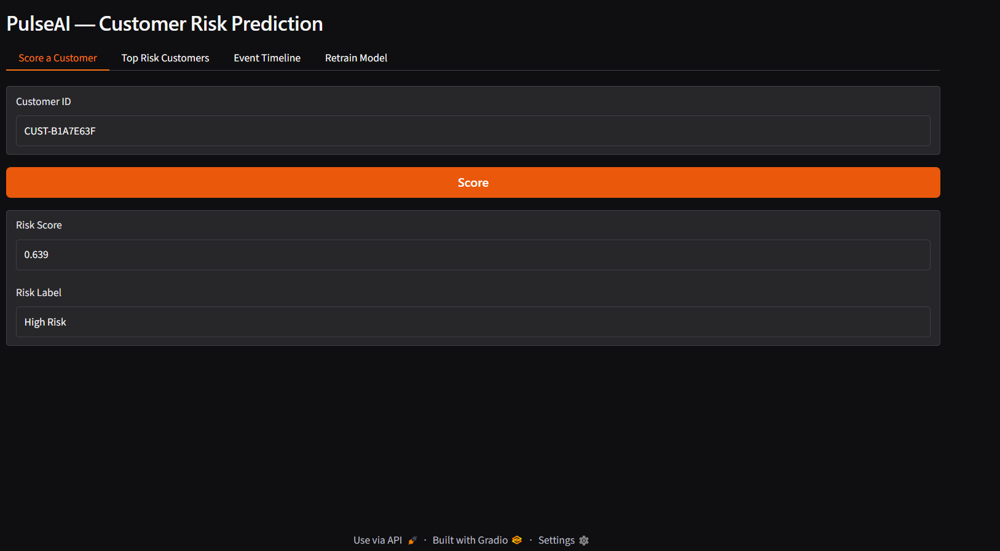
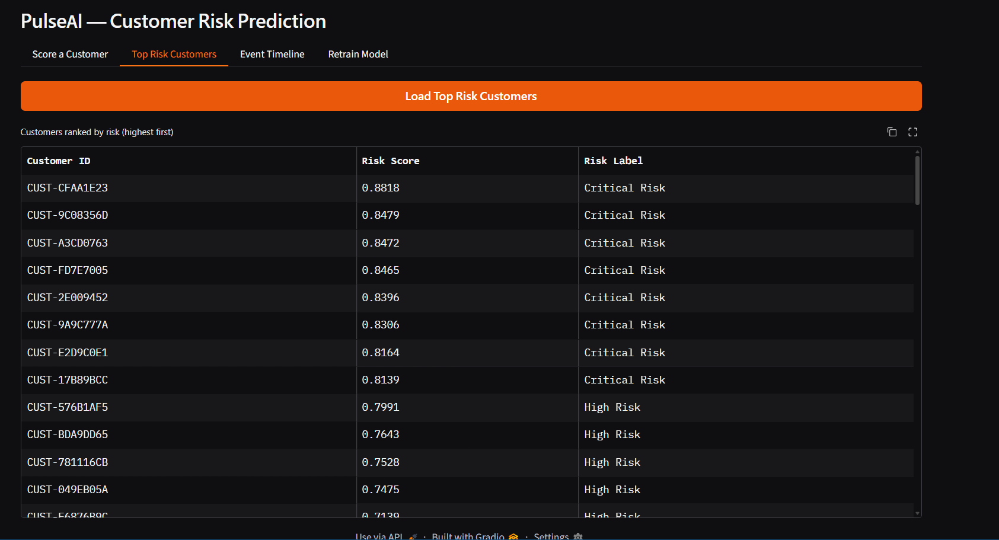
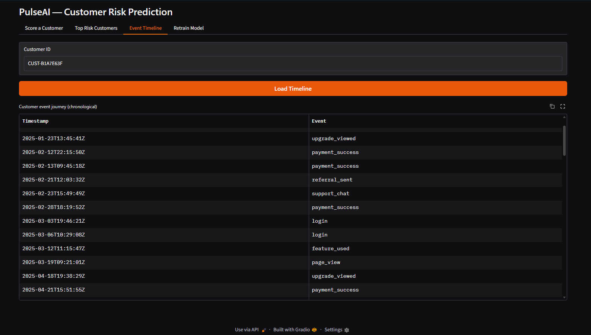
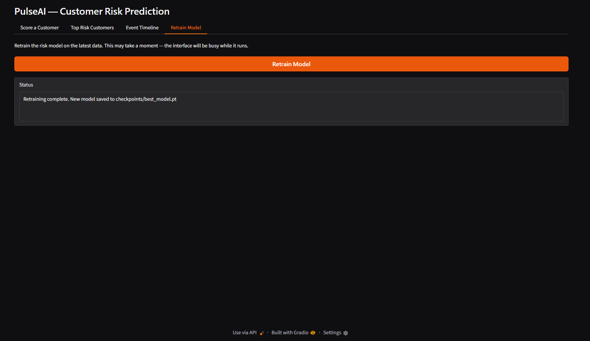

# PulseAI — Dynamic Customer Journey Risk Prediction Engine

An end-to-end machine learning system that predicts customer churn by reading a customer's full behavioral journey — not just static profile data. A dual-branch PyTorch model (LSTM for event sequences + MLP for tabular features) is trained on data unified from PostgreSQL and MongoDB, then served through an interactive Gradio dashboard deployed on Hugging Face Spaces.

---

## Live demo

**Repo:** (https://github.com/IMMRM/pulseai-risk-engine)

---

## Screenshots

| Score a customer | Top risk customers |
|---|---|
|  | |

| Event timeline | Retrain model |
|---|---|
|  | |

---

## Overview

Most churn-prediction approaches rely on static snapshots — plan type, tenure, last invoice — and miss the story of *how a customer got there*. PulseAI treats each customer's actions (logins, payment failures, support tickets, cancel-page visits) as an ordered sequence, similar to how NLP models treat a sentence as an ordered sequence of words.

The model combines two views of each customer:

- **What they did** — their event sequence, read in order by an LSTM
- **Who they are** — a set of summary features, read by an MLP

Both are fused into a single risk score between 0 and 1, mapped to a Low / Medium / High / Critical risk label.

---

## Architecture

```
Supabase (PostgreSQL)          MongoDB Atlas
  customers, transactions,       customer_events, support_tickets,
  subscriptions                  behavioral_sessions, notifications
        │                               │
        └───────────────┬───────────────┘
                         ▼
              Unified data pipeline
        (event tokenization + tabular features)
                         │
                         ▼
        ┌────────────────────────────────┐
        │   sequences   →  LSTM  → 64     │
        │   tabular     →  MLP   → 32     │──▶ concat(96) → Linear → risk score
        └────────────────────────────────┘
                         │
                         ▼
              Gradio dashboard (4 tabs)
                         │
                         ▼
            Deployed on Hugging Face Spaces
```

**Model design**

| Branch | Layers | Output |
|---|---|---|
| Sequence (LSTM) | Embedding(32) → LSTM(64) | 64-dim journey summary |
| Tabular (MLP) | Linear(32) → ReLU → Linear(32) → ReLU | 32-dim feature summary |
| Fusion | Concat(96) → Linear(1) → Sigmoid | Risk score (0–1) |

---

## Features

- **Score a customer** — enter a customer ID, get a risk score and label
- **Top risk customers** — ranked table of all customers by predicted risk
- **Event timeline** — chronological view of a customer's actions
- **Retrain model** — trigger retraining from the dashboard

---

## Model performance

Evaluated on a held-out, stratified test set:

| Metric | Score |
|---|---|
| AUC-ROC | 0.88 |
| Recall | 67% |
| Precision | 29% |
| Accuracy | 85% |

**Note on the dataset:** the model is trained on 100 synthetic customers (15% churn rate) designed to mirror real churn patterns. The focus of this project is production-grade methodology — data pipeline design, class-imbalance handling, evaluation rigor, and deployment — rather than squeezing accuracy out of a small dataset. The pipeline and modeling approach scale directly to real data volumes.

Class imbalance was addressed with a weighted `BCEWithLogitsLoss` (`pos_weight` set to the safe/churn ratio), which lifted recall from 0% to 67% over an unweighted baseline — a deliberate precision/recall tradeoff, since missing a churner is costlier than a false alarm.

---

## Tech stack

| Layer | Technology |
|---|---|
| Model | PyTorch (LSTM + MLP fusion) |
| Structured data | Supabase (PostgreSQL) |
| Unstructured data | MongoDB Atlas |
| Interface | Gradio |
| Deployment | Hugging Face Spaces |
| Evaluation | scikit-learn |

---

## Project structure

```
pulseai-risk-engine/
├── app.py                        # HF Spaces entry point
├── requirements.txt
├── src/
│   ├── config.py                 # loads .env credentials
│   ├── logger.py                 # centralized logging
│   ├── data/
│   │   ├── supabase_connector.py
│   │   ├── mongo_connector.py
│   │   ├── data_loader.py
│   │   └── data_split.py
│   ├── features/
│   │   ├── event_encoder.py      # vocabulary, encoding, padding
│   │   ├── tabular_features.py
│   │   └── pipeline.py
│   ├── models/
│   │   ├── lstm_encoder.py
│   │   ├── tabular_encoder.py
│   │   └── risk_model.py
│   ├── training/
│   │   ├── train.py
│   │   └── evaluate.py
│   ├── inference/
│   │   └── scorer.py
│   └── interface/
│       ├── ui.py
│       ├── resources.py
│       └── tabs/
│           ├── score_tab.py
│           ├── top_risk_tab.py
│           ├── timeline_tab.py
│           └── retrain_tab.py
├── data/
│   ├── raw/                      # gitignored
│   └── processed/                # gitignored
├── checkpoints/                  # gitignored
└── logs/                         # gitignored
```

---

## Dependencies

Core packages (see `requirements.txt` for full pinned versions):

```
torch
numpy
pandas
scikit-learn
psycopg2-binary
pymongo
python-dotenv
gradio
```

---

## Setup

```bash
# Clone the repo
git clone <repo-url>
cd pulseai-risk-engine

# Create a virtual environment
python -m venv .venv
.venv\Scripts\activate        # Windows
# source .venv/bin/activate   # macOS / Linux

# Install dependencies
pip install -r requirements.txt

# Configure credentials
copy .env.example .env
# fill in Supabase and MongoDB Atlas credentials

# Run the feature pipeline
python -m src.features.pipeline

# Train the model
python -m src.training.train

# Evaluate
python -m src.training.evaluate

# Launch the dashboard
python app.py
```

---

## Key engineering decisions

- **Polyglot persistence** — structured data (customers, transactions) in PostgreSQL; variable-length event/session data in MongoDB.
- **Train/serve consistency** — the inference engine reuses the exact saved vocabulary and feature pipeline from training, avoiding train/serve skew.
- **Stratified splitting** — a single shared `data_split.py` guarantees training and evaluation always see identical, class-balanced splits.
- **Class-weighted loss** — addresses churn class imbalance directly in the loss function rather than only through resampling.
- **Thin deployment entry point** — `app.py` at the repo root only imports and launches; all logic lives in `src/`, keeping Hugging Face Spaces' file convention separate from the codebase structure.

---

## License

MIT